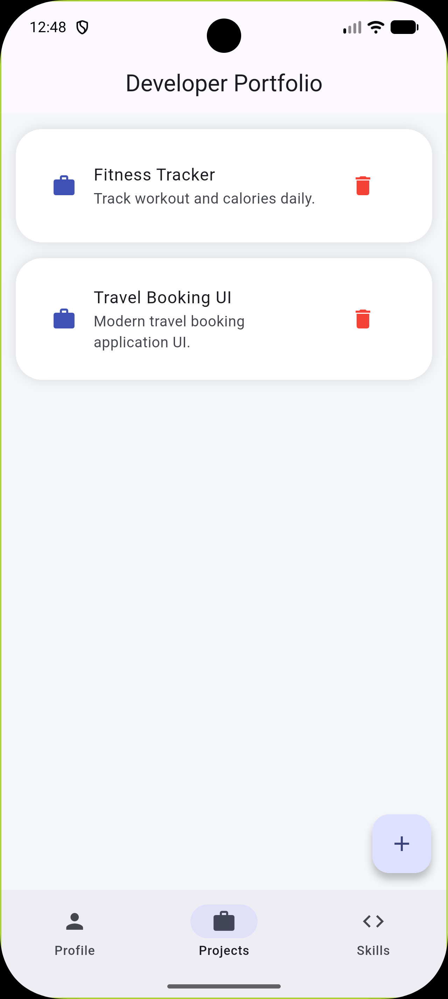

# 🚀 Profile Projects App

A modern Flutter developer portfolio application with dynamic project management and persistent local storage using SharedPreferences.

---

## 👤 Overview

This app is designed as a personal developer dashboard where users can:
- Showcase profile details
- Manage projects dynamically
- Store data locally on device
- Maintain persistent state even after app restart

It demonstrates real-world Flutter concepts like state management, JSON handling, and local storage.

---

## ✨ Features

👤 Developer Profile UI  
📂 Dynamic Project Management  
➕ Add New Projects in Real-Time  
🗑️ Swipe to Delete Projects  
💾 Persistent Local Storage (SharedPreferences)  
📊 Live Project Counter  
🌙 Modern Gradient UI Design  
📱 Fully Responsive Layout  
🔄 Data Persistence After App Restart

---

## 🛠️ Tech Stack

- Flutter
- Dart
- Material Design 3
- SharedPreferences
- JSON Encoding/Decoding

---

## 📸 Screenshots

### Home Screen


### Projects Screen


### Delete Feature


---

## 🚀 Getting Started

```bash
git clone https://github.com/YOUR_USERNAME/profile_App.git
cd profile_App
flutter pub get
flutter run